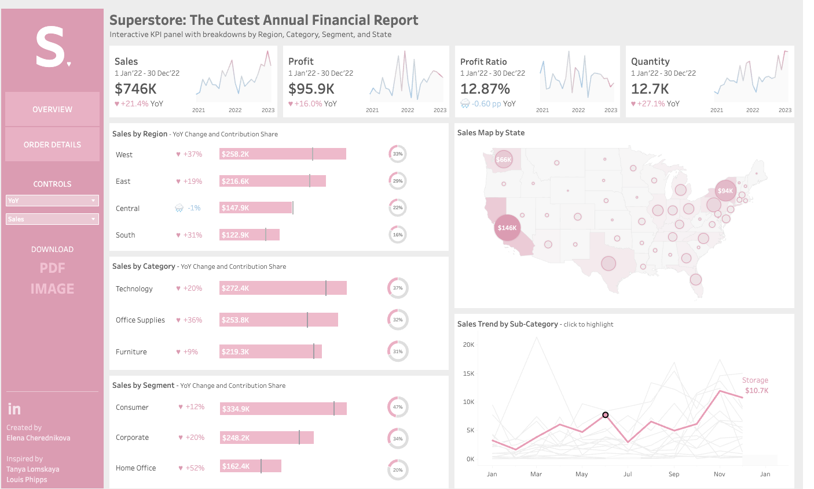
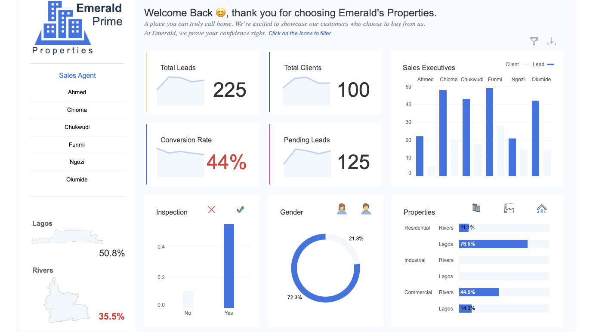

# Data Visualization

## Assignment 2: Good and Bad Data Visualization

### Requirements:

- Data visualizations are important tools for communication and convincing; we need to be able to evaluate the ways that data are presented in visual form to be critical consumers of information 
- To test your evaluation skills, locate two public data visualizations online, one good and one bad  
    - You can find data visualizations at https://public.tableau.com/app/discover or https://datavizproject.com/, or anywhere else you like! 
- For each visualization (good and bad):  
    - Explain (with reference to material covered up to date, along with readings and other scholarly sources, as needed) why you classified that visualization the way you did.
      ```
      Your answer...
      https://public.tableau.com/app/profile/elena.cherednikova/viz/TheCutestAnnualFinancialReport/Cutereview
      According to the lecture, a given visualization can be good or bad depending on the purpose for which it was created. Visualization A is a financial report, and I think for the purposes intended, this visualization is a good visualization for the following reasons.
      1. Aesthetics: visually, this visualization is engaging and pleasing to look at. The choice of a soft colour pallet makes it appealing and not intimidating given that it is a financial report.
      2. Substantivity: While we may not have enough information to determine whether the data presented is honest since we don't have any affiliation to the company in question, we can see that every information is presented in a clear and intuitive manner. For instance, the key performance indicators are clearly presented at the top of the report. It also seems accurate since both high and low sales figures are represented on the report.
      3. Perceptuality: The message that the maker of the visualization is attempting to convey can be understood. There is an interactive feature where one can click to further explore the data being reported. different chart types are utilized for different types of data, and it is also easy to do a quick comprehension of the main information by looking at the key performance indicators at the top. 
      
      While this visualization is overall good, the soft colour pallet may not make it easy for people with accessibility needs to navigate the data presented, but then again, there is no one perfect visualization as we learned in the lecture. 
          https://public.tableau.com/app/profile/gospel.chinedu.nwachukwu/viz/EmeraldRealEstateProperties/RealEstatePrime
      
      This second visualization does not pass for a good visualization for the reasons which I discuss below.
      1. Aesthetics: While the blue-white contrast makes the visualization immediately appealing, there is a lot of text and information that are competing for attention and some of which do not necessarily add significantly to the information the maker intended to convey. From the message at the top labelling, the purpose seems to be about showing customer purchases of properties and how well the company is doing in terms of these sales, but then, there is a bar plot labelled Sales executives with the names of the sales executives. There are no clear KPIs anywhere so it's difficult to determine what to focus on in this visualization. It's almost like every data is simply dumped on the visualization. 
      
      2.  context : From lecture 1, we learned that it is important to consider how and where our visualization is going to be used and this visualization seems to be infographic, that is, it is intended to persuade. Potential property buyers should be motivated to work with this company by looking at the information presented in this visualization. However, this is not likely going to be the case given that the quantities and relationships being captured in this visualization are not clearly specified. No actionable insights can be drawn by simply looking at for instance, the inspection plot or the maps on Lagos and Rivers state. The users would have to make up their own interpretations or conclusions on what these plots and maps are showing. 
      
      3. It is difficult to perceive what this visualization is conveying. There is inconsistent use of colours across charts. for instance, in inspection, blue colour stands for yes but also represents Leads/client in the larger bar plot. It is not clear whether red means bad or not and it is used in conversion rate as well as on the map on Rivers. There are no timeframes stated in this visualization, so it is practically impossible for the audience to accurate judge the performance of the company.
      
      


      ```
    - How could this data visualization have been improved?  
      ```
      Your answer...

      This data visualization can be improved in several ways. First, it is important to decide on the primary purpose of the visualization; for instance, are we trying to show that we are converting leads into client or our yearly performance? Any data that is not geared towards the purpose of the visualization would only end up distracting from the intended message and therefore should be removed. For instance, the gender chart doesn't seem to be answering any question and should be removed. 
      There should also be a consistent and standardized use of colours in order to enable easy interpretation of the message intended. Time context should be added for easier evaluation of the numbers presented across the charts. The x and y axes on the charts should be clearly labelled. Adding annotations directly on the  dashboard will also improve the perceptual quality of this visualization since they will explain what information are being displayed.  
      
      


References
Visualization A retrieved from    https://public.tableau.com/app/profile/elena.cherednikova/viz/TheCutestAnnualFinancialReport/Cutereview
Visualization B retrieved from https://public.tableau.com/app/profile/gospel.chinedu.nwachukwu/viz/EmeraldRealEstateProperties/RealEstatePrime
Data visualization tools and techniques: how to use them in business retrieved from https://www.digiteum.com/data-visualization-techniques-tools/#:~:text=credit:%20duke.edu-,Maps,dot%20distribution%20maps%2C%20and%20cartograms.
Lecture recordings on visualization


      
      ```
- Word count should not exceed (as a maximum) 500 words for each visualization (i.e. 
300 words for your good example and 500 for your bad example)

### Why am I doing this assignment?:

- This assignment ensures active participation in the course, and assesses the learning outcomes
* Apply general design principles to create accessible and equitable data visualizations
* Use data visualization to tell a story

### Rubric:

| Component               | Scoring   | Requirement                                                 |
|-------------------------|-----------|-------------------------------------------------------------|
| Data viz classification and justification | Complete/Incomplete | - Data viz are clearly classified as good or bad<br />- At least three reasons for each classification are provided<br />- Reasoning is supported by course content or scholarly sources |
| Suggested improvements  | Complete/Incomplete | - At least two suggestions for improvement<br />- Suggestions are supported by course content or scholarly sources |

## Submission Information

🚨 **Please review our [Assignment Submission Guide](https://github.com/UofT-DSI/onboarding/blob/main/onboarding_documents/submissions.md)** 🚨 for detailed instructions on how to format, branch, and submit your work. Following these guidelines is crucial for your submissions to be evaluated correctly.

### Submission Parameters:
* Submission Due Date: `23:59 - 10/26/2025`
* The branch name for your repo should be: `assignment-2`
* What to submit for this assignment:
    * This markdown file (assignment_2.md) should be populated and should be the only change in your pull request.
* What the pull request link should look like for this assignment: `https://github.com/<your_github_username>/visualization/pull/<pr_id>`
    * Open a private window in your browser. Copy and paste the link to your pull request into the address bar. Make sure you can see your pull request properly. This helps the technical facilitator and learning support staff review your submission easily.

Checklist:
- [ ] Create a branch called `assignment-2`.
- [ ] Ensure that the repository is public.
- [ ] Review [the PR description guidelines](https://github.com/UofT-DSI/onboarding/blob/main/onboarding_documents/submissions.md#guidelines-for-pull-request-descriptions) and adhere to them.
- [ ] Verify that the link is accessible in a private browser window.

If you encounter any difficulties or have questions, please don't hesitate to reach out to our team via our Slack. Our Technical Facilitators and Learning Support staff are here to help you navigate any challenges.
